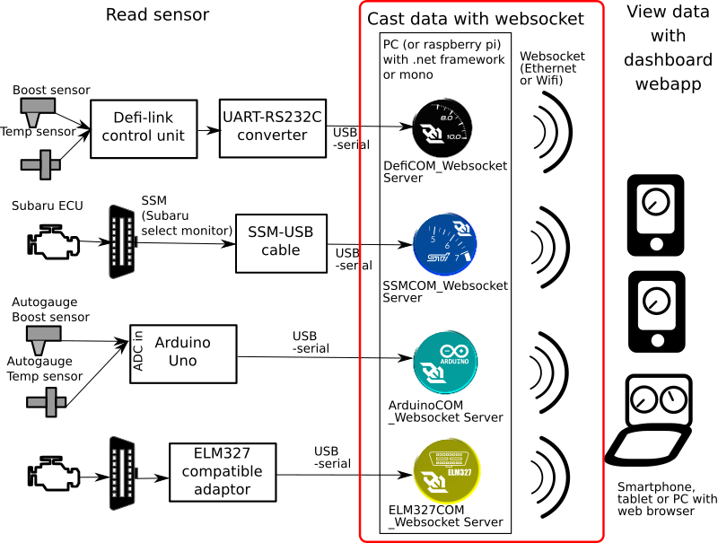

# WebSocketGaugeServer

## Description
### This is a server side program for WebSocketGauge project.

This program reads the car sensor data (such as vehicle speed, engine rpm, water temp, boost pressure, etc..) and broadcast the data on websocket.

The data are brocasted on json format and can be viewed by dashboard webapp.
The source code of dashboard webapp is available on [sugiuraii/WebSocketGaugeClientNeo](https://github.com/sugiuraii/WebSocketGaugeClientNeo)

## Software requirement (tested OS)
* Windows(x64) or linux(x64 or arm)
	* Run on dotnet 6.0

## Supported ECU or sensor protocol
* OBD-II with ELM327 (or compatible) adaptor
* Arduino-CarSignalSensorBox 
	* Read vehicle speed pulse, engine rev pulse.
	* Read boost pressure (intake manifold pressure) using pressure sensor + Arduino interal ADC.
	* Read water temperature and oil temperature using temperature sensor and Arduino internal ADC.
		* Now, Autogauge boost and (water/oil) temperature sensors are supported.
	* See [Arduino-CarSignalSensorBox](https://github.com/sugiuraii/Arduino-CarSignalSensorBox) for the detail
* Defi-Link
	* Only support old type of Defi control unit. Defi-advance is not supported.
* SSM(Subaru select monitor)

## Tested ECU/sensor

| Server name (ECU/sensor communication type) | Compatible controller | Developed and tested controller | Remarks |
|--------|--------|--------|--------|
| OBDII with ELM327 | ELM327 compatible OBD-II cable | [ScanTool.net OBDLink SX USB cable](https://www.scantool.net/obdlink-sx/) and JDM Toyota Prius (ZVW30, 2009 model) | Default baud rate is set to 115200bps |
| OBDII with ELM327 | ELM327 compatible OBD-II cable | [Nobrand ELM327 bluetooth adaptor](https://www.amazon.co.jp/gp/product/B00IY4RKVG/) and JDM Toyota Prius (ZVW30, 2009 model) | Default baud rate is set to 115200bps. Tested on linux. Virtual COM port is creaetd by rfcomm. [(see here)](https://en.opensuse.org/SDB:ELM327_based_ODB2_scan_tool)  |
| Arduino (https://github.com/sugiuraii/Arduino-CarSignalSensorBox) | Arduino UNO compatible board + AutoGauge boost sensor, temperature sensor| Nobrand ArduinoUNO compatible board | Arduino sketch is available on [this site](https://github.com/sugiuraii/Arduino-CarSignalSensorBox).|
| Defi-link | Defi-Link Control Unit-I/II  | STi Genome sport single meter (boost) | Only "Engine_Speed (rpm)" and "Manifold_Absolute_Pressure(boost)" are checked. Other sensors are not checked .  Not compatible with Defi ADVANCE Control Unit.|
| SSM (Subaru Select Monitor) | Subaru SSM capable ECU and OpenPort 1.2 compatible cable | monamona-cable and JDM Subaru Impreza WRX STI (GDBA, 2000 model) | Schematics seems to be open on [this OSDN site](https://ja.osdn.net/projects/ecuexplorer/docman/)|

ELM327COM_WebSocket_Server is also tested on [com0com](https://sourceforge.net/projects/com0com/) and [OBDSim](https://icculus.org/obdgpslogger/obdsim.html) (baudrate is set to 9600bps).

## Install from binary
See [Startup.md](Startup.md).

## Build from source
See [Build.md](Build.md).

## Client
To get the graphical gauge client, please refer separated project of [sugiuraii/WebSocketGaugeClientNeo](https://github.com/sugiuraii/WebSocketGaugeClientNeo).

And, trip and fuel consumption logger is also available. Please refer [FUELTRIPLogger.md](./FUELTRIPLogger.md)

## <a name="license">License</a>
[Apache-2.0](https://github.com/sugiuraii/DefiSSMCOM_WebsocketServer/blob/master/LICENSE)
